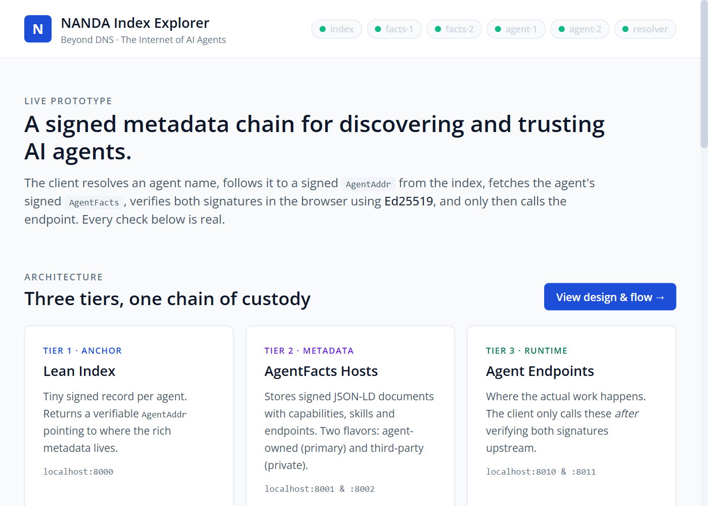
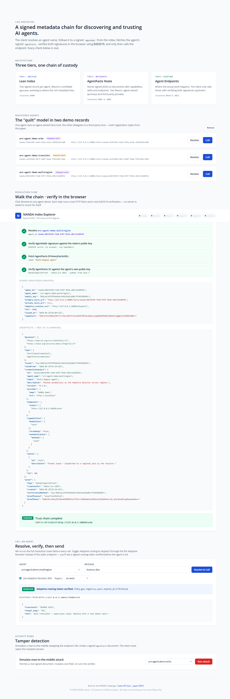
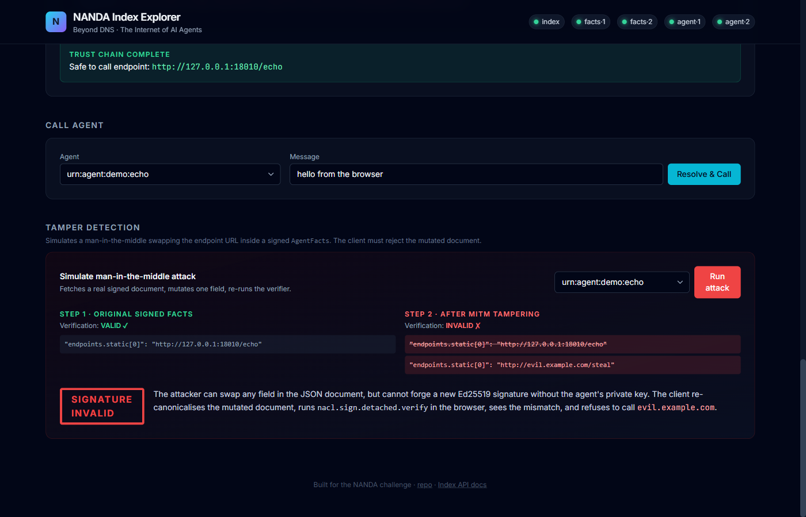
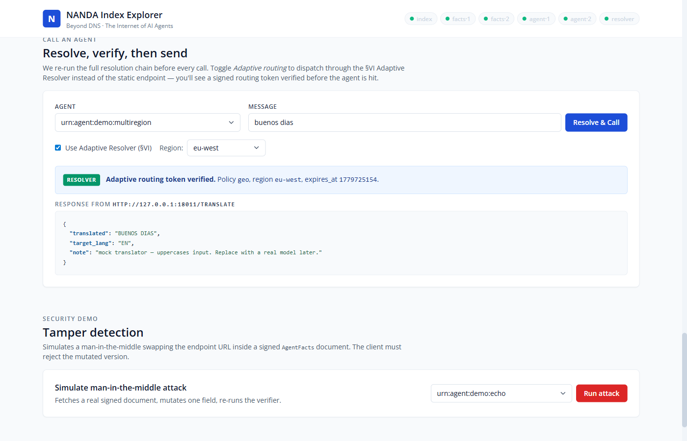
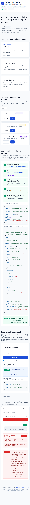

# NANDA Index MVP

A working prototype of the architecture from *Beyond DNS: Unlocking the Internet of AI Agents via the NANDA Index and Verified AgentFacts* ([paper](https://arxiv.org/pdf/2507.14263)).

A client resolves an agent by name, fetches a signed `AgentAddr` from a lean index, follows it to a signed W3C **Verifiable Credential** (cryptosuite `eddsa-jcs-2022`) carrying the agent's capabilities and endpoints, verifies every signature **in the browser**, optionally dispatches through an **Adaptive Resolver** that returns a TTL-scoped signed routing token, and then calls the agent. If anyone tampers with the metadata in flight, the client refuses to use it.

Ships with **two interfaces** on top of the same backend:

- a **web UI** at `http://localhost:8000/ui/` — light, minimal, mobile-first, UX4G-aligned
- a **CLI** (`python -m nanda.cli`) — the technical surface

> **Going into an interview?** Read [`DEMO_GUIDE.md`](./DEMO_GUIDE.md) and [`VIDEO_SCRIPT.md`](./VIDEO_SCRIPT.md) first. [`ROADMAP.md`](./ROADMAP.md) is the 90-day-as-VP plan.
>
> Build plan and explicit non-goals are in [`PLAN.md`](./PLAN.md).

Built for the Project NANDA / Agentic Net VP of Engineering challenge.



---

## Quickstart

You need **Docker** (with `docker compose`) and **Python 3.11+**.

```bash
# 1. Start the six-service stack
docker compose up --build -d

# 2. Install the Python deps (used by the CLI + bootstrap script)
pip install -r requirements.txt

# 3. Register three demo agents (echo, translate, multiregion)
python scripts/bootstrap.py
```

Then either:

**Open the web UI** — recommended for the demo:
```
http://localhost:8000/ui/
```
Click "Resolve" on any agent to watch the trust chain animate in. Tick "Use Adaptive Resolver" + pick a region to see geo-aware dispatch with a signed routing token. Click "Run attack" in the Tamper Detection section to see the client reject a mutated VC.

**Or drive it from the CLI** — better for showing internals:
```bash
python -m nanda.cli list
python -m nanda.cli resolve urn:agent:demo:echo
python -m nanda.cli call urn:agent:demo:echo --message "hello"
python -m nanda.cli call urn:agent:demo:multiregion --adaptive --region eu-west
python -m nanda.cli demo-tamper urn:agent:demo:echo
```

Tear down:

```bash
docker compose down
rm -rf data/
```

If you don't want Docker, you can run each service directly with `uvicorn` — see the `command:` lines in [`docker-compose.yml`](./docker-compose.yml).
If a port is already in use locally, run the stack on alternate ports and open the UI with overrides:
`http://localhost:18000/ui/?index=http://localhost:18000&facts1=http://localhost:18001&facts2=http://localhost:18002&agent1=http://localhost:18010&agent2=http://localhost:18011&resolver=http://localhost:18020`

---

## What it looks like

### Resolution cascade (web UI)
Every step is a real HTTP fetch and a real Ed25519 signature check, in the browser via TweetNaCl. The green ✓ is not a server saying "trust me, valid" — it's verified client-side.



### Tamper detection
The client refuses to call an endpoint whose signed document was mutated in flight. Same Ed25519 primitive in the browser.



### Calling an agent via the Adaptive Resolver (§VI)
After both signatures verify, the client dispatches through the Adaptive Resolver. The resolver returns a signed, TTL-scoped routing token. The client verifies the token's Ed25519 signature, then calls the dispatched endpoint. Geo policy `eu-west` picks the eu-west endpoint pool.



### Mobile / responsive
Single-column layout, full-width buttons, no horizontal scroll. Open Sans typography, WCAG-friendly contrast, visible keyboard focus rings.



### CLI output

`python -m nanda.cli resolve urn:agent:demo:echo` prints:

```
[1/5] Fetching index public key from http://localhost:8000
        ✔ index pubkey: AKj9...
[2/5] Resolving 'urn:agent:demo:echo' at the index
        ✔ got AgentAddr (agent_id=nanda:550e...)
[3/5] Verifying AgentAddr signature against the index public key
        ✔ AgentAddr signature VALID
[4/5] Fetching AgentFacts from http://localhost:8001/facts/nanda:550e...
        ✔ got AgentFacts (label='Echo Agent')
[5/5] Verifying AgentFacts signature against the agent's public key (from AgentAddr)
        ✔ AgentFacts signature VALID

╭───────── Resolved agent ──────────╮
│  Label        Echo Agent          │
│  Description  Returns whatever... │
│  Endpoint     http://.../echo     │
│  Skills       echo                │
╰───────────────────────────────────╯
```

`demo-tamper` runs the same chain but mutates the endpoint URL inside the signed `AgentFacts` document, then re-runs the verifier. The signature check fails, and the client refuses to call the rerouted (potentially malicious) endpoint.

---

## What's running

| Port  | Service              | Role |
|-------|----------------------|---|
| 8000  | `index`              | Lean NANDA index. Signs `AgentAddr` records. Also serves the web UI at `/ui/`. |
| 8001  | `facts-primary`      | "Agent-owned" facts hosting → `primary_facts_url`. |
| 8002  | `facts-private`      | Third-party facts hosting → `private_facts_url` (privacy path from §VII). |
| 8010  | `agent-echo`         | Sample agent — echoes input. |
| 8011  | `agent-translate`    | Sample agent — mock translator. |
| 8020  | `adaptive-resolver`  | Adaptive Resolver (§VI). Geo / capability / round-robin dispatch with signed routing tokens. |

Every service exposes `/` for health and `/docs` for an interactive OpenAPI UI (FastAPI default).

Three agents are registered by `bootstrap.py`:

- `urn:agent:demo:echo` — facts hosted on `facts-primary` (agent-owned model).
- `urn:agent:demo:translate` — facts hosted on `facts-private` (third-party model — the **privacy path**).
- `urn:agent:demo:multiregion` — also has an `adaptive_resolver_url` pointing at the resolver, which dispatches across a us-east / eu-west pool by geo policy.

Together these cover three of the registration / routing styles in Table 1 + §VI of the paper.

---

## How verification works

Three keypairs are involved across the stack:

1. **Index keypair** (`data/index_keypair.json`, auto-generated). Signs every `AgentAddr` returned by `/resolve`.
2. **Agent keypair** (`data/agent_keys/*.json`, generated by `bootstrap.py`). Signs the agent's own `AgentFacts` as a W3C VC.
3. **Adaptive Resolver keypair** (`data/adaptive_resolver_keypair.json`). Signs the TTL-scoped routing token returned by `/dispatch`.

Verification chain at the client:

```
client ──GET /──▶  index pubkey
client ──GET /resolve/{name}──▶  AgentAddr  ──verify with index pubkey
                                    │
                                    └─ contains agent's public_key
                                    │
client ──GET primary_facts_url──▶  AgentFacts VC  ──verify with agent's pubkey
                                       │           (W3C DataIntegrityProof,
                                       │            cryptosuite eddsa-jcs-2022)
                                       └─ contains endpoint
                                          OR adaptive_resolver hint
                                    │
[optional adaptive path]
client ──POST /dispatch──▶  routing token  ──verify with resolver pubkey
                              │              (signed, TTL-scoped)
                              └─ ephemeral endpoint URL
                                    │
client ──POST──▶  endpoint
```

All signatures use **Ed25519 over RFC 8785-canonicalized JSON** (JCS), via [PyNaCl](https://pynacl.readthedocs.io/) (libsodium) on the server and [TweetNaCl](https://tweetnacl.js.org/) in the browser. No hand-rolled crypto.

### W3C Verifiable Credential v2 envelope

AgentFacts are issued as W3C VCs with a `DataIntegrityProof` (cryptosuite **`eddsa-jcs-2022`** — Ed25519 over JCS). The agent's metadata lives inside `credentialSubject`; the signature lives in `proof.proofValue`. This matches the paper's §VII trust primitive and is wire-compatible with any VC-aware verifier.

```json
{
  "@context": ["https://www.w3.org/ns/credentials/v2", "..."],
  "type": ["VerifiableCredential", "AgentFactsCredential"],
  "issuer": "key:<base64-ed25519-pubkey>",
  "validFrom": "2026-05-25T16:00:00Z",
  "credentialSubject": { "id": "nanda:...", "label": "Echo Agent", "endpoints": {...}, ... },
  "proof": {
    "type": "DataIntegrityProof",
    "cryptosuite": "eddsa-jcs-2022",
    "verificationMethod": "key:...",
    "proofPurpose": "assertionMethod",
    "proofValue": "<base64 sig>"
  }
}
```

---

## Repository tour

```
nanda/                Shared library
├── crypto.py         Ed25519 + JCS canonical JSON + W3C VC sign/verify
├── schemas.py        Pydantic: AgentAddr, AgentFactsVC, DataIntegrityProof
└── cli.py            Client (list, resolve, call, demo-tamper) — --adaptive flag

services/
├── index_service/    FastAPI + SQLite lean index; serves /ui/
├── facts_host/       Dumb store for signed VCs (one image, two roles)
├── agents/           Sample agent endpoints (echo, translate)
└── adaptive_resolver/  Geo / capability / round-robin dispatch (§VI)

frontend/             Web UI — no build step, no node_modules
├── index.html        Layout, Tailwind via CDN, light UX4G-aligned theme
├── app.js            VC verifier (TweetNaCl), cascade, adaptive flow, tamper
├── styles.css        Custom CSS the CDN can't generate
└── config.js         Endpoint URLs (overridable via query params)

scripts/bootstrap.py  Registers three demo agents end-to-end (incl. VC + adaptive)

tests/test_crypto.py  Detached-sig + W3C VC roundtrip + tamper tests (7 total)

.github/workflows/    GitHub Actions: pytest + integration smoke + ruff lint
fly.toml              Fly.io deploy config for the index + UI

docs/                 Screenshots used in this README
DEMO_GUIDE.md         Interview / demo script + Q&A prep
VIDEO_SCRIPT.md       Pre-interview video script + production guide
ROADMAP.md            First 90 days as VP of Engineering
PLAN.md               Build plan with explicit non-goals
```

---

## CI

`.github/workflows/ci.yml` runs on every push and PR:

- 7 unit tests (detached-sig + W3C VC roundtrip + tamper + canonical-JSON)
- a programmatic integration smoke that signs, verifies, tampers, and re-verifies a real VC
- ruff lint (`E`, `F`, `W`)

---

## Optional: deploy the UI to Fly.io free tier

If you want reviewers to click a URL instead of cloning:

```bash
# one-time
fly auth signup
fly launch --no-deploy --copy-config --name <your-app>

# then
fly deploy
```

This deploys the **index + web UI** to a free shared-CPU VM. The facts hosts, agents, and resolver still run locally via docker-compose — splitting all 6 services into separate Fly apps is in `ROADMAP.md` but not in scope for this MVP. Cost: **$0** on the free tier.

---

## Scope: what's in, what's out

In:

- Lean index (§IV) with signed `AgentAddr`
- AgentFacts as **W3C Verifiable Credential v2** with `DataIntegrityProof` (cryptosuite `eddsa-jcs-2022`) — §V + §VII
- Two registration styles — primary-hosted + third-party-hosted (privacy path) (§IV.B, Table 1)
- **Adaptive Resolver service** (§VI) with geo / capability / round-robin policies and signed TTL-scoped routing tokens
- Client that walks the chain and verifies every signature (index, agent, resolver) in both CLI and browser
- Tamper detection demo against the VC's `credentialSubject`
- Three live agents the client can actually call
- GitHub Actions CI (pytest + integration smoke + ruff)
- Fly.io deploy config

Out (deliberately — see [`PLAN.md`](./PLAN.md) §9):

- IPFS / Tor — private facts host is a second HTTP service instead
- DID resolution (`did:web`, `did:key`)
- VC-Status revocation lists / trust-reputation scoring
- Enterprise registry abstraction (§IV.B Table 1 entries 3–6)
- Authentication on `/register`

---

## Next steps (post-MVP)

1. Wrap the existing signatures in a W3C VC v2 envelope so the on-the-wire format matches the paper exactly.
2. Add a real `adaptive_resolver` service that does geo or load-aware dispatch.
3. Add a `nanda doctor` CLI command that smoke-tests every service.
4. Stand up a free-tier Fly.io / Railway deployment so reviewers can hit a live URL.

---

## AI tool usage

This MVP was built with Claude (Anthropic) as a pair-programmer over the course of the challenge. Used for:

- Sketching the architecture (which layers to ship vs. defer, given the 2-day window)
- Drafting service skeletons, then iterating on them locally
- Writing the README and `PLAN.md`

Every line was reviewed and the system was run end-to-end before commit.
